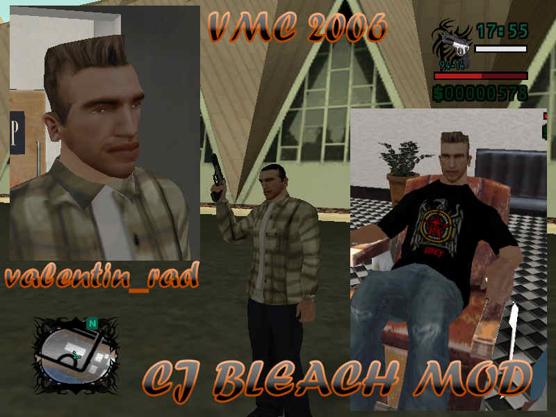

## Ce este?
**GTA Vali's City** este un mod de tip conversie totală pentru **Vice City**, creat la începutul anilor 2000, ce încorporează elemente din Half-Life 2, Matrix, Mafia și alte lucruri populare în acea perioadă.

La bază stă alt mod, "City of Lost Heaven" (inspirat de Mafia 1), pe care Vali's City îl extinde, adăugând o savoare românească cu misiuni, mașini, locații personalizate.

Caracteristici iconice:
- 12 misiuni (4 principale + 8 secundare via telefon mobil cu TAB)
- Vehicule sport, arme noi, 12 outfit-uri, 22 skin-uri
- Radio custom: *B.U.G. Mafia*, *Ca$$a Loco*, *Nightwish* și *VALI'S ROCK*
- Bonusuri: Salvat rapid (C), viață/armură gratuită (TAB la mașina de înghețată), nitro la Pay 'n' Spray
- Activități: Curse motocross, fotbal Steaua vs. Dinamo, time-trial PCJ-600

Astăzi, 20+ de ani mai târziu, Vali's City trăiește datorită fanilor. Vă mulțumim!

## Link-uri

**Social media**
- [Dă-ne LIKE pe Facebook](https://www.facebook.com/GTAValiCity/) 👍
- [Dă-ne FOLLOW pe YouTube](https://www.youtube.com/@GTAValiCity) 📺

**Remake: Vali's City Reloaded (2025)**
- **În dezvoltare!** Restructurare misiuni, lore extins (Claudiu Florea & MattL1010)

  <iframe width="560" height="315" src="https://www.youtube.com/embed/5PEoYlhfXTM?si=JsD2HNrZaoVvwto8" title="YouTube video player" frameborder="0" allow="accelerometer; autoplay; clipboard-write; encrypted-media; gyroscope; picture-in-picture; web-share" referrerpolicy="strict-origin-when-cross-origin" allowfullscreen></iframe>

**Versiunea îmbunătățită 2025 – repară multe probleme ale originalului**
- [Descarcă de pe https://gtamoduri.ro/](https://gtamoduri.ro/gta-valis-city) ✨ (SilentPatch, Open Limit Adjuster, Widescreen Fix, traduceri full, dificultate redusă)

**Versiunea originală (RC2, 2005)**
- [Descarcă .RAR](https://1drv.ms/u/c/fda6ec336a4f80ef/IQDxlAXOiswJQ6BxBqbUijP_AXxkXp9ht0Fx4aHLDrIe02U?e=vPAVb8) 💾
- [Descarcă .TORRENT](./assets/GTA-Vali-City-RC2.torrent) 💿
- [Vezi site-ul VECHI – 2005](./old-site/index.html) 🏛️
- [Descarcă „City of Lost Heaven”](https://github.com/RadValentin/gta-city-of-lost-heaven/releases/latest/)

## Despre Vali's City
### Cum a apărut modul
Am lucrat la mod între vara lui 2004 și primăvara lui 2005, eram în liceu, clasa a 10-a. Nu aveam internet acasă atunci, trebuia să mă duc la sala de calculatoare ca să descarc moduri care de multe ori nu mergeau sau făceau jocul să crash-uiască. Inițial doar instalam moduri random, dar cu timpul am vrut să fac ceva mai coerent. Gen un GTA al meu, de aici și numele. Tool-urile disponibile pe atunci erau foarte simpliste, documentația pentru cum faci misiuni era aproape inexistentă, modelarea 3D implica soft și tutoriale la care nu aveam acces (nu aveam net). Așa că am făcut ce am putut: reskin la greu la o conversie totală stil Mafia, făcută de altcineva, folosind ce asset-uri aveam prin PC sau pe CD-uri: texturi din HL2, trailerul la Matrix etc.

  <figure class="gallery-item">
    
    <figcaption>Skin Gordon Freeman</figcaption>
  </figure>
  <figure class="gallery-item">
    
    <figcaption>Skin Matrix</figcaption>
  </figure>
  <figure class="gallery-item">
    
    <figcaption>Poster Half-Life 2</figcaption>
  </figure>

Când am început modarea, "City of Lost Heaven" îl aveam doar în rusă și nu exista Google Translate încă. Nici texturile pt literele chirilice nu le aveam. Cred că Vali City în sine a pornit din încercarea mea de a traduce intuitiv modul original.

Mod-ul l-am făcut mai mult pentru mine și câțiva colegi de școală. Nu intenționam să-l distribui prin țară, nici nu aveam cum și, sincer, majoritatea care-l jucaseră atunci erau oarecum ambivalenți în privința lui: era ok, dar cam atât.

Marea mea dramă în legătură cu Vali's City și motivul pt care m-am lăsat de modding este că o versiune "beta" a început să circule prin școală la începutul lui 2005. În scurt timp a ajuns la sălile de calculatoare din oraș și mai departe în țară; aceasta ar fi RC1-ul de care vorbeați. Treaba e că, odată ce lumea juca modul în stare beta, nu mai era interesată de noi update-uri sau de varianta finală. Chestia asta m-a demotivat, simțeam că pierd vremea aiurea și mă enerva faptul că nu am putut să-l lansez când voiam eu, mai polisat. Versiunea RC2 a fost încercarea mea de a finaliza ce începusem, dar interesul oamenilor pierise pt mod. A început să se răspândească abia prin 2010, când, la cererea unor fani, l-am pus online (cred că pe Pirate Bay). Sper că Reloaded o să fie "cum ar fi arătat" Vali City dacă l-aș fi dus la final.

### Despre personaje
Legat de Xena. Aveam nevoie de un nume pt liderul rockerilor, iar „Xena” era porecla unui tovarăș rocker; o dobândise prin școala primară pt că obișnuia să urle cât îl țineau plămânii pe holurile școlii. Dar îmi place mai mult varianta voastră.

Numele "Loqust" era inside joke, aveam un amic poreclit lăcustă.

  <figure class="gallery-item">
    
    <figcaption>Misiune Loqust</figcaption>
  </figure>
  <figure class="gallery-item">
    
    <figcaption>Geantă de cumpărături Loqust</figcaption>
  </figure>
  <figure class="gallery-item">
    
    <figcaption>Panou publicitar Loqust</figcaption>
  </figure>

  <figure class="gallery-item">
    
    <figcaption>Idee de panou Loqust</figcaption>
  </figure>
  <figure class="gallery-item">
    
    <figcaption>Idee de poster Loqust 1</figcaption>
  </figure>
  <figure class="gallery-item">
    
    <figcaption>Idee de poster Loqust 1</figcaption>
  </figure>

"Johnny Tabacco" trebuia să fie skin de Michael Jackson, dar a devenit altceva când am scris textul pt misiuni.

La clubul de strip-tease, Pole Position, una din dansatoare (cea îmbrăcată, cu 88) este inspirată de o tipă de care îmi plăcea atunci. Ea nu mă plăcea pe mine, de asta am pus-o la locul ei în joc 🙂

  <figure class="gallery-item">
    
    <figcaption>Dansatoare Pole Position 1</figcaption>
  </figure>
  <figure class="gallery-item">
    
    <figcaption>Dansatoare Pole Position 2</figcaption>
  </figure>

### Curiozități
Am primit ban pe Filelist prin 2014 deoarece făcusem cerere de upload pt mod. Ei au considerat asta o formă de reclamă. Voiam doar ca modul să ajungă la lume, nu am cerut niciun ban și chiar nu mi-am asociat numele complet cu modul din acest motiv. Mai aiurea este că Mamaia Vice este pe Filelist; mi-ar fi plăcut să fie și Vali City acolo.

Am modat și San Andreas; unul din moduri e încă online: [CJ Bleach Mod](https://www.thegtaplace.com/downloads/f2030-cj-bleach-mod), care îl face pe CJ alb.

  <figure class="gallery-item">
    
    <figcaption>CJ Bleach Mod pt San Andreas</figcaption>
  </figure>

E posibil ca și cinematicul pt prima misiune din Vice City să fie în limba română. Gen dacă pui fișierul cu misiunile originale. Nu am avut timp să verific, dar așa țin minte.

Sunetul ambiental din "North Point Mall" (Metro) este luat din Half-Life 2, cred că e din Ravenholm, nu sunt sigur.

  <figure class="gallery-item">
    
    <figcaption>Skin FPS</figcaption>
  </figure>
  <figure class="gallery-item">
    
    <figcaption>Poster LULV (Lumea Lui Vali)</figcaption>
  </figure>
  <figure class="gallery-item">
    
    <figcaption>Panou Băsescu</figcaption>
  </figure>

