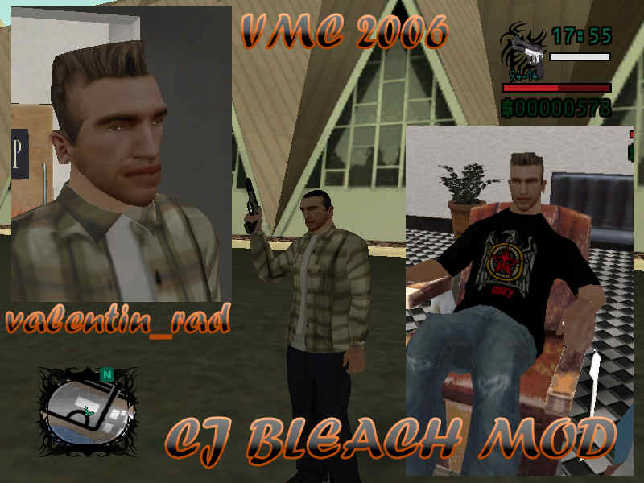

## Ce este?
**GTA Vali's City** este un mod de tip conversie totală pentru **Vice City**, creat la începutul anilor 2000, ce încorporează elemente din Half-Life 2, Matrix, Mafia și alte lucruri populare în acea perioadă.

La bază stă alt mod, "City of Lost Heaven" (inspirat de Mafia 1), pe care Vali's City îl extinde, adăugând o savoare românească cu misiuni, mașini, locații personalizate.

**Caracteristici iconice:**
- 12 misiuni (4 principale + 8 secundare via telefon mobil cu TAB)
- Vehicule sport, arme noi, 12 outfit-uri, 22 skin-uri
- Radio custom: *B.U.G. Mafia*, *Ca&dollar;&dollar;a Loco*, *Nightwish* și *VALI'S ROCK*
- Bonusuri: Salvat rapid (C), viață/armură gratuită (TAB la mașina de înghețată), nitro la Pay 'n' Spray
- Activități: Curse motocross, fotbal Steaua vs. Dinamo, time-trial PCJ-600

Astăzi, 20+ de ani mai târziu, Vali's City trăiește datorită fanilor. Vă mulțumim!

## Link-uri

### Social media
- [Dă-ne LIKE pe Facebook](https://www.facebook.com/GTAValiCity/) 👍
- [Dă-ne FOLLOW pe YouTube](https://www.youtube.com/@GTAValiCity) 📺

### Remake: Vali's City Reloaded (2026)
- **În dezvoltare!** Restructurare misiuni, lore extins (Claudiu Florea & MattL1010)

  <iframe width="560" height="315" src="https://www.youtube.com/embed/5PEoYlhfXTM?si=JsD2HNrZaoVvwto8" title="YouTube video player" frameborder="0" allow="accelerometer; autoplay; clipboard-write; encrypted-media; gyroscope; picture-in-picture; web-share" referrerpolicy="strict-origin-when-cross-origin" allowfullscreen></iframe>

### Versiunea îmbunătățită 2025 – repară multe probleme ale originalului
- [Descarcă de pe https://gtamoduri.ro/](https://gtamoduri.ro/gta-valis-city) ✨ (SilentPatch, Open Limit Adjuster, Widescreen Fix, traduceri full, dificultate redusă)

### Versiunea originală (RC2, 2005)
- [Descarcă .RAR](https://1drv.ms/u/c/fda6ec336a4f80ef/IQDxlAXOiswJQ6BxBqbUijP_AXxkXp9ht0Fx4aHLDrIe02U?e=vPAVb8) 💾
- [Descarcă .TORRENT](./assets/GTA-Vali-City-RC2.torrent) 💿
- [Vezi site-ul VECHI – 2005](./old-site/index.html) 🏛️
- [Descarcă *City of Lost Heaven*](https://github.com/RadValentin/gta-city-of-lost-heaven/releases/latest/) 📻

## Despre Vali's City
### Cum a apărut modul

Am lucrat la mod între vara lui 2004 și primăvara lui 2005, pe vremea când eram în liceu, clasa a 10-a. Nu aveam internet acasă, așa că trebuia să merg la sala de calculatoare pentru a descărca moduri, care de multe ori nu funcționau sau făceau jocul să se blocheze. La început doar instalam moduri la întâmplare, dar treptat am simțit nevoia să creez ceva mai coerent: un GTA "al meu", de aici și numele.

Tool-urile disponibile atunci erau foarte rudimentare, documentația pentru crearea misiunilor era aproape inexistentă, iar modelarea 3D presupunea software și tutoriale la care nu aveam acces. Așa că m-am concentrat pe ce era mai ușor de modificat: texturi, stații radio, texte de misiuni, înlocuirea mașinilor din joc cu modele descărcate și mult reskin pe o conversie totală în stil Mafia realizată de altcineva (**City of Lost Heaven**). Am folosit asset-uri pe care le aveam deja prin PC sau pe CD-uri - texturi din HL2, trailerul din Matrix etc.

  <figure class="gallery-item">
    
    <figcaption>Skin Gordon Freeman</figcaption>
  </figure>
  <figure class="gallery-item">
    
    <figcaption>Skin Matrix</figcaption>
  </figure>
  <figure class="gallery-item">
    
    <figcaption>Poster Half-Life 2</figcaption>
  </figure>

Când am început să modez, "City of Lost Heaven" îl aveam doar în rusă, iar Google Translate nici nu exista încă. Nu aveam nici măcar texturile pentru literele chirilice, așa că, în mare parte, nu înțelegeam ce se întâmpla în misiunile acelui mod. Într-un fel, Vali City s-a născut din încercarea mea de a traduce intuitiv și de a face "al meu" modul original.

Mod-ul l-am făcut în primul rând pentru mine și pentru câțiva colegi de școală. Nu intenționam să-l distribui prin țară — nici nu aveam cum — și, sincer, cei care l-au jucat atunci erau mai degrabă ambivalenți: era ok, dar cam atât.

Marea mea dezamăgire legată de Vali's City și motivul pentru care m-am lăsat de modding a fost faptul că o versiune "beta" a început să circule prin școală la începutul lui 2005. În scurt timp a ajuns în sălile de calculatoare din oraș și mai departe în țară; aceasta este, de fapt, versiunea **RC1** pe care mulți au jucat-o. Odată ce lumea juca modul în stadiu beta, interesul lor pentru update-uri sau pentru o variantă finală dispărea aproape complet.

Lucrul acesta m-a demotivat puternic. Aveam senzația că muncesc degeaba și mă frustra faptul că nu am reușit să-l lansez atunci când mi-aș fi dorit, într-o formă mai finisată. Versiunea **RC2** lansată în primăvara lui 2005, care a devenit și finală, a fost încercarea mea de a duce la capăt ce începusem, dar interesul pentru mod deja se risipise. Aceasta a început să se răspândească abia prin 2010, când, la cererea unor fani, am pus-o online (cred că pe Pirate Bay). Sper ca varianta **Reloaded**, la care se lucrează momentan, să fie într-un fel "cum ar fi arătat" Vali City dacă aș fi reușit să-l duc la bun sfârșit.

### Despre personaje

Numele rockerului pe care îl ajuți în prima misiune, **Xena** i-a confundat pe mulți jucători. Nu era clar de ce avea nume de fată. Unii credeau că numele sau modelul lui 3D au fost puse greșit. Adevărul este că atunci când modificam misiunile aveam nevoie de un nume pt liderul rockerilor, iar "Xena" era porecla unui tovarăș rocker; o dobândise prin școala primară deoarece obișnuia să urle cât îl țineau plămânii pe holurile școlii 😄

Mafiotul care îți dă misiunile din joc, **Johnny Tabacco** era făcut să semene cu **Michael Jackson** și ar fi trebuit să fie un spoof al acestuia. Când am început să modific textele misiunilor mi s-a părut foarte nostim să-l fac să vorbească cât mai vulgar. Până la urmă, asemănarea cu idolul pop a rămas doar vizuală.

La clubul de strip-tease, Pole Position, una din dansatoare (cea îmbrăcată în bluza cu 88) este inspirată de o fată de care îmi plăcea atunci. Ea nu mă plăcea pe mine, chiar mă ignora. Nu mai țin minte intenția originală dar presupun că am pus-o acolo ca un fel de răzbunare digitală. Ani de zile mai târziu, serialul *Black Mirror* a dus această idee la extreme în episodul [USS Callister](https://www.imdb.com/title/tt5710974/).

  <figure class="gallery-item">
    
    <figcaption>Dansatoare Pole Position 1</figcaption>
  </figure>
  <figure class="gallery-item">
    
    <figcaption>Dansatoare Pole Position 2</figcaption>
  </figure>

Brandul fake ce apare în joc, **Loqust** era gândit ca un spoof la brandul real *Lacoste* dar făcut să sune ca **Low Cost**. Totodată, **Lăcustă** era și porecla unui bun prieten, de aceea numele apare și la una dintre misiuni.

  <figure class="gallery-item">
    
    <figcaption>Misiune Loqust</figcaption>
  </figure>
  <figure class="gallery-item">
    
    <figcaption>Geantă de cumpărături Loqust</figcaption>
  </figure>
  <figure class="gallery-item">
    
    <figcaption>Panou publicitar Loqust</figcaption>
  </figure>

Pentru **Reloaded** am sugerat să extindem brandul puțin cu panouri publicitare și postere ce duc mai departe ideea de low cost românesc.

  <figure class="gallery-item">
    
    <figcaption>Idee de panou Loqust</figcaption>
  </figure>
  <figure class="gallery-item">
    
    <figcaption>Idee de poster Loqust 1</figcaption>
  </figure>
  <figure class="gallery-item">
    
    <figcaption>Idee de poster Loqust 1</figcaption>
  </figure>

Celelalte personaje care apar în joc nu sunt la fel de bine definite. **Mike** probabil era inspirat de *Michael Corleone*, pur și simplu aveam nevoie de un nume de gangster. **Jake**, de la misiunea cu motocross, cred că este referință la un alt amic rocker pasionat de motociclete, el avea numele de familie Iacob -> Jacob -> Jake. Iar numele boss-ului final, **Lică** cel mai probabil este placeholder, încă lucram la misiunea finală când modul a fost leakuit, așa că e foarte posibil ca "Lică" să fi fost un nume ales pe loc (ceva auzit la TV).

### Curiozități
Am primit ban pe **FileList** prin 2014 deoarece făcusem cerere de a pune modul pe platforma lor. Ei au considerat asta ca fiind o formă de reclamă, era modul meu și credeau că încerc să mă promovez. Voiam doar ca modul să ajungă la lume, nu era niciun interes financiar la mijloc și chiar nu mi-am asociat numele complet cu modul din acest motiv. Mai aiurea este că Mamaia Vice este pe Filelist; mi-ar fi plăcut să fie și Vali City acolo.

Am modat și San Andreas; unul din moduri e încă online: [CJ Bleach Mod](https://www.thegtaplace.com/downloads/f2030-cj-bleach-mod), care îl face pe CJ alb.

  <figure class="gallery-item">
    
    <figcaption>CJ Bleach Mod pt San Andreas</figcaption>
  </figure>

Cinematicul pentru prima misiune din Vice City este tradus în limba română. Dacă pui fișierul cu misiunile originale VC, se poate vedea.

Sunetul ambiental din "North Point Mall" (Metro) este luat din Half-Life 2, cred că e din Ravenholm.

  <figure class="gallery-item">
    
    <figcaption>Skin FPS</figcaption>
  </figure>
  <figure class="gallery-item">
    
    <figcaption>Poster LULV (Lumea Lui Vali)</figcaption>
  </figure>
  <figure class="gallery-item">
    
    <figcaption>Panou Băsescu</figcaption>
  </figure>

Privind înapoi, Vali's City reprezintă mai mult o fotografie a anilor 2000 și a începuturilor modding-ului românesc, decât un produs finit.